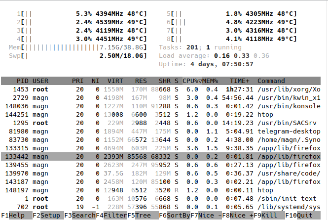

# Konsole-eink
E-Ink color theme for KDE Konsole terminal https://konsole.kde.org/

 
# Installation
1. Clone or download this repo
2. `cp konsole-eink.colorscheme ~/.local/share/konsole/`
3. Chooze the new color theme in your current profile
